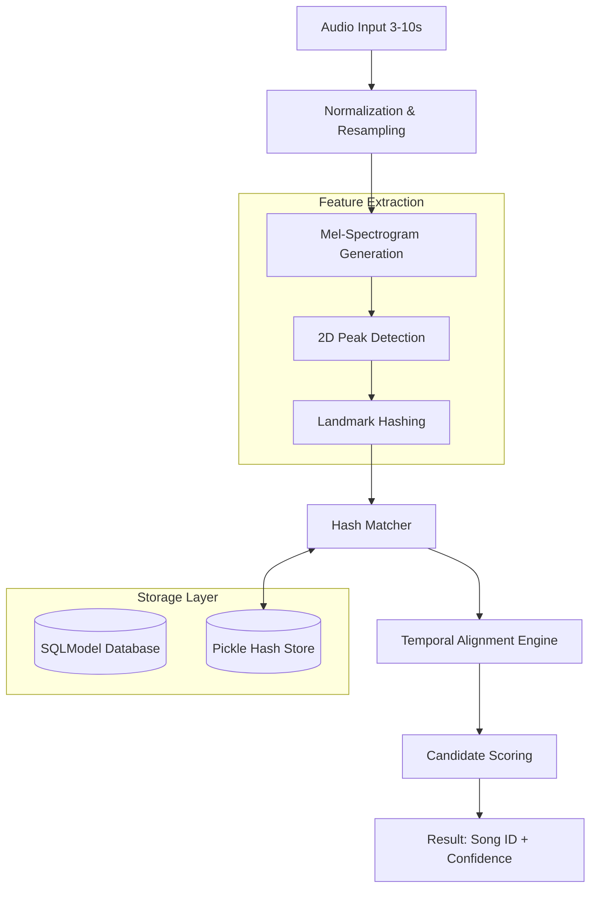

# Audio Identification System - Technical Architecture

This document details the architecture for **Zerograde's** audio identification system, designed for high-performance matching of short, noisy audio clips.

## High-Level Architecture



## Core Components

### 1. Preprocessing Pipeline
To ensure consistency across various audio sources:
- **Resampling**: All audio is downsampled to 22,050 Hz.
- **Normalization**: Volume is normalized to standard peak levels using `librosa.util.normalize`.
- **Mono Conversion**: Multichannel audio is collapsed to a single channel.

### 2. Mel-Spectrogram & Peak Detection
Instead of raw FFT bins, the system uses **Mel-Frequency Banding** (128 mels). This provides:
- **Robustness**: Mel-bands are more resilient to small frequency shifts and noise.
- **Efficiency**: Reduces the dimensionality of the spectral data while preserving musical features.
- **2D Peaks**: A maximum filter identifies local energy peaks (constellations) in the frequency-time space.

### 3. Landmark Hashing (Precision)
- **Algorithm**: Pairs identified peaks within a "fan-out" zone.
- **Hash Structure**: `(freq1, freq2, delta_time)` associated with an absolute `offset_time`.
- **Strength**: Landmarks are extremely resistant to additive noise because they focus on dominant spectral energy.

### 4. Storage & Retrieval
- **Metadata (SQLite)**: Stores song details (title, artist, genre) using `SQLModel`.
- **Fingerprint Store (Pickle)**: A persistent `defaultdict` maps hashes to lists of `(song_id, offset)`. This provides $O(1)$ lookup time for query hashes.

### 5. Temporal Alignment & Scoring
This is the "secret sauce" for high accuracy:
- **Consistent Offsets**: For each candidate song, the engine calculates the difference between the database offset and the query offset ($D = S_{offset} - Q_{offset}$).
- **Histogram Density**: A true match will have a high concentration of identical $D$ values (the "offset alignment").
- **Confidence**: Calculated based on the density of the most frequent offset relative to the total number of hashes in the query.

## Project Structure
```text
/
├── docs/                   # Documentation Side
│   ├── technical_overview.md
│   ├── architecture.md
│   └── ISSUES.md
├── src/                    # Development Side
│   ├── app/                # Core logic (models, features, store)
│   ├── static/             # Frontend assets
│   ├── data/               # Raw audio & fingerprints.pkl
│   ├── main.py             # FastAPI Entry point
│   ├── index_dataset.py    # Batch indexing script
│   ├── evaluate_accuracy.py# Metrics script
│   └── generate_metadata.py# Metadata generation script
├── audio_id.db             # SQLite Database
└── pyproject.toml          # Project configuration
```

## Detailed Data Flow
1. **Ingestion**: `generate_metadata.py` scans audio folders and creates a `metadata.csv`.
2. **Database Setup**: `main.py` (via `/ingest` endpoint) populates the SQLite database with song metadata.
3. **Indexing**: `index_dataset.py` processes raw audio files, extracts landmarks, and builds the `fingerprints.pkl` index.
4. **Querying**: 
    - `main.py` receives a query file.
    - `BaselineFingerprinter` extracts landmarks from the clip.
    - `MatchingEngine` performs temporal alignment against the index.
5. **Monitoring**: `LatencyTracker` logs performance metrics.
