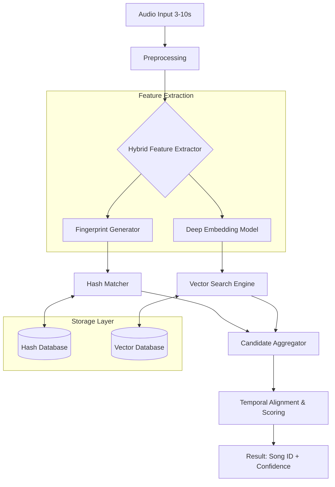

# Audio Identification System - Technical Architecture

This document details the architecture for **Zerograde's** audio identification system, designed to handle short, noisy, and incomplete audio clips.

## High-Level Architecture



## Core Components

### 1. Preprocessing Pipeline
To ensure robustness against noise and distortion:
- **Normalization**: Downsample to 22,050 Hz and convert to mono.
- **Denoising**: Apply **Spectral Subtraction** to remove background white noise.
- **VAD (Voice Activity Detection)**: Filter out silent or non-audio segments to focus on actual musical content.

### 2. Fingerprint Generator (Precision)
- **Algorithm**: Modified Landmark-based hashing.
- **Process**:
    1. Generate a **Spectrogram** using STFT.
    2. Identify **Local Peaks** (constellations) in frequency-time space.
    3. Pair peaks with a target zone to create **unique hashes**.
- **Strength**: Extremely resistant to additive noise and low-bitrate compression.

### 3. Deep Embedding Model (Robustness)
- **Model**: Pre-trained **VGGish** or **Audio Spectrogram Transformer (AST)**.
- **Process**: Map 960ms windows of audio into a 128-dimensional latent space.
- **Strength**: Handles pitch shifts, speed variations, and severe distortions that might break exact hash matching.

### 4. Storage & Retrieval
- **Hash Database (Redis/PostgreSQL)**: Stores hashes as keys for $O(1)$ lookup.
- **Vector DB (FAISS/ChromaDB)**: Uses HNSW (Hierarchical Navigable Small World) indexing for sub-millisecond similarity search across thousands of embeddings.

### 5. Scoring & Confidence
The final score is calculated as:
$$Confidence = \alpha \cdot (\text{Fingerprint Match Count}) + \beta \cdot (1 - \text{Cosine Distance})$$
Temporal alignment ensures that matches occur in a linear sequence, filtering out false positives.

## Project Structure
```text
ps1/
├── app/
│   ├── api/            # API Endpoints (main.py routes)
│   ├── core/           # Core Logic (features.py, matching)
│   ├── data/           # Storage Logic (store.py)
│   ├── models/         # Data Schemas (song.py)
│   └── utils/          # Metrics & Utilities (metrics.py)
├── data/
│   ├── raw/            # Place original audio files here
│   └── audio_id.db     # SQLite Database (Metadata)
├── main.py             # Entry point (FastAPI)
├── index_dataset.py    # Batch processing script
└── evaluate_accuracy.py # Metrics script
```

## Detailed Data Flow
1. **Ingestion**: `MetadataIngestor` parses CSV data into SQLite using `SQLModel`.
2. **Indexing**: `index_dataset.py` iterates through audio files, extracts spectral peaks, generates hashes, and saves them to a persistent `fingerprints.pkl`.
3. **Querying**: 
    - Incoming audio is saved to a temporary location.
    - `BaselineFingerprinter` extracts peaks from the 3-10s clip.
    - `MatchingEngine` queries the `FingerprintStore` for each hash.
    - **Temporal Alignment**: For each candidate song, we check if the difference between the query offset and database offset is consistent ($S_{offset} - Q_{offset} = \text{constant}$).
    - **Confidence**: The highest density of consistent offsets determines the match and confidence score.
4. **Monitoring**: `LatencyTracker` logs processing time, and `/health` provides system status.

## Concurrency & Performance
The system utilizes `FastAPI`'s asynchronous nature and `uvicorn`'s worker model to handle concurrent queries. The `FingerprintStore` uses an in-memory `defaultdict` for $O(1)$ lookups, ensuring sub-second response times even as the dataset grows.
